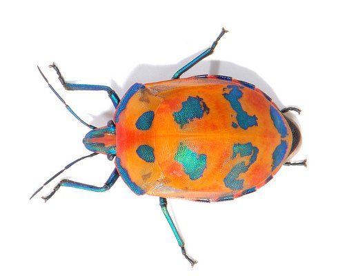

!SLIDE bullets incremental
# What is Scrum? #
_if you are not in the talk_

* <http://en.wikipedia.org/wiki/Scrum>
* <http://www.scrum.org>

!SLIDE bullets incremental transition=fade
# What is Scrum? #

* Roles (Chicken and Pork)
* Meetings
* Documents

!SLIDE bullets incremental transition=fade
# Roles #

* Product Owner
* Scrum Master
* Team
* Users, test groups, coworkers...

!SLIDE bullets incremental transition=fade
# Meetings #

* Sprint planning
* Daily Scrum
* Sprint review (Demo)

!SLIDE bullets incremental transition=fade
# Documents #

* Product backlog
* Sprint backlog
* Burndown Chart

!SLIDES center
# Scrum Wall #

!SLIDES center smaller incremental transition=fade
# BUGS! #

Bug: _Sam Fraser Smith_ [flickr]("http://www.flickr.com/photos/samfrasersmith")

